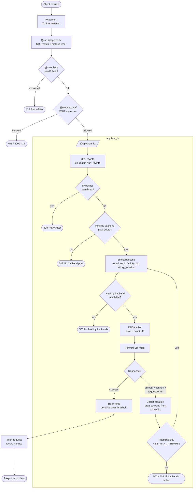

# apython_lb

An async HTTP(S) load balancer and reverse proxy built on
[Quart](https://quart.palletsprojects.com/). It fronts a pool of backends with
round-robin or sticky routing, health checks with a circuit breaker, per-IP
rate limiting, a libmodsecurity-powered WAF, URL rewriting, Prometheus
metrics, and a live management web UI.

## Motivation

apython_lb was built on [Quart](https://quart.palletsprojects.com/) because it is a
low-cost (in engineering time) way to get a fully async application off the
ground. Quart is an industry-standard, Flask-compatible ASGI framework, so the
patterns are familiar and the ecosystem is mature — there is no bespoke runtime
to learn or maintain.

The biggest win is Quart's `@app.route` decorator. It turns URL configuration
into a first-class, declarative concern: routes, path parameters, and HTTP
methods are parsed and dispatched by the framework, which lets apython_lb layer its
own behavior (load balancing, rate limiting, the WAF, URL rewriting) on top as
composable decorators. Instead of hand-rolling a request router, apython_lb spends
its engineering budget on the proxy and traffic-management logic that actually
matters.

## Features

- **IP tracker** — watches per-IP behavior (e.g. bursts of 404s) and penalises
  abusive clients for a configurable window.
- **Local DNS cache** — resolves and caches backend hostnames so request hot
  paths avoid repeated lookups.
- **Rate limiter** — app-wide or per-route request limits with `429` +
  `Retry-After` responses.
- **Round robin** — distributes requests evenly across a backend's healthy IPs.
- **Sticky by IP** — pins a client IP to the same backend for session affinity
  without cookies.
- **Sticky by session** — pins a signed session to the same backend for
  cookie-based affinity.
- **URL rewriting** — match and rewrite request paths before forwarding (strip
  or inject prefixes, remap routes) via per-route `url_match`/`url_rewrite`
  regex patterns.
- **WAF** — libmodsecurity3-powered web application firewall, enabled by
  default, blocking SQLi/XSS/scanners and other malicious requests.
- **Circuit breaker** — when a request to a backend fails (timeout, connection,
  or request error), that backend is removed from the active backends list and
  the request is immediately retried against a freshly selected backend (up to
  `LB_MAX_ATTEMPTS`). Non-idempotent requests (POST) are only retried when the
  failure happened before the request was sent (connect errors) — an ambiguous
  failure mid-request is never replayed. A background health checker
  independently re-checks all backends and restores them to the active list
  once they recover.
- **Metrics** — Prometheus metrics exposed at `/metrics` (via
  `prometheus-client`): request counts, latency histograms, and in-progress
  gauges per endpoint, plus backend selections/retries/errors, healthy-server
  counts, rate-limit rejections, 404-tracker penalties, and WAF
  allowed/blocked inspections. All metric definitions live in `metrics.py`.
- **Management web UI** — a live admin page at `/v1/manage` (HTMX, restricted
  to internal/private network IPs) for adding and removing backend configs,
  watching per-backend health, and viewing/resetting per-IP rate-limit usage.
  The page connects to a WebSocket at `/ws/configs`, and the backend manager
  broadcasts updated config and backend-health state to every connected admin
  session whenever configs change or a health check alters the pool — no
  manual refresh needed. When multiple configs share a name, the last one in
  wins: the most recently created (or explicitly selected via the UI's
  "select" button) config controls the backend pool for that name.

## Request Flow

A request is processed by a stack of composable decorators, each able to
short-circuit with an early response before it ever reaches a backend:



## Variable Reference

| Variable | Default | Description |
|---|---|---|
| `IP_TRACKER_404_THRESHOLD` | `4` | Number of 404s within the window before an IP is penalised |
| `IP_TRACKER_WINDOW_SECONDS` | `120` | Rolling window (seconds) in which 404s are counted |
| `IP_TRACKER_PENALTY_DURATION` | `300` | How long (seconds) a penalised IP is blocked |
| `RATE_LIMIT_REQUESTS` | `100` | Max requests per IP within the rate limit window (app-wide limiter) |
| `RATE_LIMIT_WINDOW_SECONDS` | `60` | Rolling window (seconds) for the rate limiter |
| `LOG_LEVEL` | `INFO` | Effectively a two-position switch (see [Logging](#logging)): `INFO` shows only hypercorn access/startup logs; `DEBUG` shows all app logs too. Config lives in `log_config.py`, applied by both `main.py` and `hypercorn_config.py` |
| `APP_SECRET_KEY` | *(auto-generated)* | Secret key used for sticky session signing. If unset, a random per-process key is generated at startup (logged as a WARNING) — sticky sessions then won't survive restarts or span replicas, so **set it explicitly in production** |
| `MANAGE_BASIC_AUTH` | *(unset)* | Optional `user:password` for HTTP Basic auth on the management UI, `/ws/configs`, and `/metrics`, on top of the internal-IP restriction. Set it in any deployment where the internal network is not fully trusted |
| `MAX_CONTENT_LENGTH` | `16777216` | Maximum request body size in bytes (bodies are buffered in memory for WAF inspection and forwarding) |
| `HEALTH_CHECK_INTERVAL` | `60` | How often (seconds) backends are health-checked. A backend is healthy only when it answers `GET /` with HTTP **200** (see [Health checks](#health-checks)) |
| `CONFIG_POLL_INTERVAL` | `10` | How often (seconds) the DB is polled for config changes |
| `DNS_NAMESERVERS` | `8.8.8.8,1.1.1.1` | Comma-separated DNS nameservers for backend hostname resolution (the Docker image sets `1.1.1.1`) |
| `LB_MAX_ATTEMPTS` | `3` | Total tries per request before giving up (initial attempt + retries on timeout/connect/request errors) |
| `LB_UPSTREAM_HTTP2` | `true` | Whether the upstream httpx client negotiates HTTP/2 |
| `LB_UPSTREAM_VERIFY_TLS` | `true` | Whether the upstream httpx client (proxying **and** health checks) verifies backend TLS certificates. Only disable for backends with self-signed certs you cannot fix |
| `LB_UPSTREAM_TIMEOUT_SECONDS` | `30` | Per-request timeout (seconds) for forwarding to a backend |
| `STICKY_SESSION_MAX_ENTRIES` | `10000` | Maximum tracked session→backend pins; oldest pins are evicted at capacity |
| `STICKY_IP_MAX_ENTRIES` | `10000` | Maximum tracked IP→backend pins; oldest pins are evicted at capacity |

## Health checks

A backend server is considered healthy **only when `GET /` (with the
configured `Host` header) returns HTTP `200`** — redirects, `204`, or any
other status mark it unhealthy. This is a deliberate, fixed contract: point
the backend's root at something that returns `200`, or terminate a
lightweight 200 responder on `/`. The `hc_path` config field is accepted and
stored but currently reserved — health checks always probe `/`. If your use
case needs a configurable path or status set, fork and adapt; if it becomes a
popular request we'll revisit with community input.

## Deployment notes

- **Client identity is the TCP peer address.** Rate limiting, 404 penalties,
  sticky-IP routing, the WAF, and the internal-only restriction all key on
  `remote_addr` — `X-Forwarded-For` is deliberately not trusted. Run
  apython_lb as the first hop from clients. If you must front it with another
  proxy, every client collapses into the proxy's IP: shared rate limits,
  shared 404 penalties, and (for private proxy IPs) an internal-looking
  source for the management UI — so set `MANAGE_BASIC_AUTH`.
- **`/v1/manage`, `/ws/configs`, and `/metrics` are internal-only** (RFC1918 /
  loopback source IPs). IP checks alone are weak on shared networks; add
  `MANAGE_BASIC_AUTH` for real authentication.

## Logging

`LOG_LEVEL` behaves as a single two-position switch rather than a graduated
severity dial:

- **`INFO` (default):** only **hypercorn** access and startup logs are emitted.
  Hypercorn's own loggers are pinned at INFO in `log_config.py` so request
  access logs and startup messages always appear exactly once.
- **`DEBUG`:** everything above, **plus all application logs** (routing,
  health checks, rate limiting, WAF, DNS resolution, etc.).

All application log lines are emitted at `DEBUG` on purpose. This keeps normal
(`INFO`) operation to a clean hypercorn access log and means turning on app
diagnostics is a single, deliberate flip to `DEBUG` — there are no routine app
logs at `INFO`/`WARNING`/`ERROR` to reason about.

The one deliberate exception: **security-significant conditions are logged at
`WARNING`/`ERROR` so they are visible at the default level** — a requested WAF
that failed to initialise (engine load failure, `ERROR`), a per-request WAF
transaction failure (`WARNING`), and a missing `APP_SECRET_KEY` replaced by an
auto-generated key (`WARNING`). These indicate degraded protection, not
routine operation, and should never be hidden behind `DEBUG`.

`httpx` logs one `HTTP Request: ...` line per call at INFO — health checks and
proxied requests would otherwise flood the access log. It is pinned to `WARNING`
and only surfaces its per-request lines when `LOG_LEVEL=DEBUG`, following the
same rule as the app loggers.

Lower-level libraries are noisier still and bury the app's own logs even when
debugging: `httpcore` (connection internals), `hpack` (per-header HTTP/2
encoding), and `aiosqlite` (every query and operation) all emit at DEBUG. They
are pinned to `ERROR` at all levels, so only genuine failures appear.

**No sensitive data is logged at any level.** Request headers and bodies are
never logged. Session IDs are auth-equivalent tokens, so sticky-session logs
emit a non-reversible `sess-<8 hex>` tag (sha256-derived) instead of the raw
session ID — enough to correlate a session across log lines without exposing
the token. Client IPs are retained as core load-balancer operational data
(and are already present in hypercorn's access logs).

## Running Locally
Hypercorn serves TLS and expects `/app/cert.pem` and `/app/key.pem` inside the container. `*.pem` files are gitignored, so a fresh clone has none — without them every worker crashes at startup with `FileNotFoundError` from `create_ssl_context`. Generate a self-signed pair and mount it:

```bash
mkdir -p certs
openssl req -x509 -newkey rsa:2048 -keyout certs/key.pem -out certs/cert.pem \
  -days 365 -nodes -subj "/CN=localhost"

docker build --target final -t apython_lb:local .
docker run --rm -p 8443:443 \
  -v "$PWD/certs/cert.pem":/app/cert.pem:ro \
  -v "$PWD/certs/key.pem":/app/key.pem:ro \
  apython_lb:local

curl -sk https://localhost:8443/health
```

### Kubernetes

The manifests in `docs/k8s/deploy/` mount a `apython-lb-tls` secret to `/app/cert.pem` and `/app/key.pem`. Both the `apython-lb` and `apython-lb-test` deployments share this one secret, so create it once per cluster from your ACME-issued cert/key before applying the manifests. The deployments also read `APP_SECRET_KEY` from an `app-secrets` secret (see [Variable Reference](#variable-reference)):

```bash
kubectl create secret tls apython-lb-tls \
  --cert=./fullchain.pem \
  --key=./privkey.pem \
  --namespace=default

kubectl create secret generic app-secrets \
  --from-literal=secret-key=<your-secret-key>

kubectl apply -f docs/k8s/deploy/dev-nodeport-apython-lb.yaml
kubectl apply -f docs/k8s/deploy/dev-nodeport-apython-lb-test.yaml
```

To rotate the TLS secret after renewing the cert:

```bash
kubectl create secret tls apython-lb-tls \
  --cert=./fullchain.pem \
  --key=./privkey.pem \
  --namespace=default \
  --dry-run=client -o yaml | kubectl apply -f -

kubectl rollout restart deployment/apython-lb deployment/apython-lb-test --namespace=default
```

## Examples

### Rate limiting
```python
# Use the app-wide limiter (RATE_LIMIT_REQUESTS / RATE_LIMIT_WINDOW_SECONDS)
@app.route("/<path:path>", methods=["GET", "POST"])
@rate_limit
@apython_lb(backend_name="my_backend", route_policy="round_robin")
def proxy(path): pass


# Give a route its own dedicated limiter
@app.route("/api/<path:path>", methods=["GET", "POST"])
@rate_limit(limit=10, window=60)
@apython_lb(backend_name="my_backend", route_policy="round_robin")
def api_proxy(path): pass
```
Rejected requests get a `429` with a `Retry-After` header.

### URL rewrite
```python
# Strip a /v1 prefix before forwarding
@app.route("/v1/", defaults={"path": ""})
@app.route("/v1/<path:path>", methods=["GET", "POST"])
@apython_lb(
    backend_name="my_backend",
    route_policy="sticky_ip",
    url_match=r"^v1/(.+)$",
    url_rewrite=r"\1",
)
def v1_proxy(path): pass


# Rewrite /api/users/123 → /users/123 using a named group
@app.route("/api/<path:path>", methods=["GET", "POST"])
@apython_lb(
    backend_name="my_backend",
    route_policy="round_robin",
    url_match=r"^api/(?P<rest>.+)$",
    url_rewrite=r"\g<rest>",
)
def api_proxy(path): pass


# Inject a fixed prefix: /files/foo.txt → /static/files/foo.txt
@app.route("/files/<path:path>", methods=["GET", "POST"])
@apython_lb(
    backend_name="my_backend",
    route_policy="round_robin",
    url_match=r"^(files/.+)$",
    url_rewrite=r"static/\1",
)
def files_proxy(path): pass
```
### Add backends via curl
The examples assume the container from [Running Locally](#running-locally),
listening on `https://localhost:8443` (`-k` because the local cert is
self-signed). Backend IPs are comma-separated with no spaces; all five fields
are required (`hc_path` is stored but not yet used — see
[Health checks](#health-checks)):
```bash
curl -sk -X POST https://localhost:8443/v1/manage/configs \
  -H "Content-Type: application/json" \
  -d '{
    "name": "multi-backend",
    "proto": "https",
    "host": "example.com",
    "ips": "1.2.3.4,5.6.7.8,app.example.com",
    "hc_path": "/healthz"
  }'
```
Check it was saved:
```bash
curl -sk https://localhost:8443/v1/manage | grep -o 'config id: [0-9]*'
```
Delete by ID:
```bash
curl -sk -X DELETE https://localhost:8443/v1/manage/configs/1
```

## WAF rules

The WAF is powered by [libmodsecurity3](https://github.com/owasp-modsecurity/ModSecurity) and is **enabled by default** in the Docker image and the bundled Kubernetes manifests. The engine is implemented as a `ctypes` wrapper around the libmodsecurity C API — no compiled Python extension or build tools are required. The rules file shipped at `/app/modsecurity.conf` is loaded automatically on startup.

### WAF variables

| Variable | Docker default | Description |
|---|---|---|
| `MODSECURITY_ENABLED` | `true` | Set to `false` to disable the WAF |
| `MODSECURITY_RULES_FILE` | `/app/modsecurity.conf` | Path to the ModSecurity rules file |
| `MODSECURITY_FAIL_CLOSED` | `false` | When `true`, refuse to start (and reject requests on per-request engine failures with a 500) if the WAF was requested but cannot run. When `false`, such failures log at `ERROR`/`WARNING` and traffic continues **uninspected**. The `waf_engine_enabled` Prometheus gauge reports the live state |

### Phase 1 rules (URI and headers — checked before the request body is read)

| ID | Status | Description |
|---|---|---|
| `910001` | 400 | Null byte (`\x00`) in URI or request headers |
| `910002` | 400 | Path traversal pattern (`../`, `..\`) in URI or query args |
| `910003` | 400 | Ambiguous `Transfer-Encoding` value (request smuggling vector) |
| `910004` | 414 | Request URI longer than 2048 characters |
| `910010` | 403 | `User-Agent` matches a known security scanner (sqlmap, nikto, nmap, masscan, w3af, skipfish, dirbuster, gobuster, wfuzz, Burp Suite, Metasploit, Hydra, Havij, Acunetix, Nessus, OpenVAS) |
| `910020` | 403 | SQL injection detected in URI or query string (via libinjection `@detectSQLi`) |
| `910021` | 403 | XSS detected in URI or query string (via libinjection `@detectXSS`) |

### Phase 2 rules (request body — checked after the body is fully received)

| ID | Status | Description |
|---|---|---|
| `910030` | 403 | SQL injection detected in request body or parsed args (via libinjection `@detectSQLi`) |
| `910031` | 403 | XSS detected in request body or parsed args (via libinjection `@detectXSS`) |
| `910032` | 403 | Remote file inclusion — `http://`, `https://`, or `ftp://` URL found in request body or args |

> **Note on rule `910032`:** it blocks *any* request body containing a URL,
> which is a large false-positive surface for JSON APIs whose payloads
> legitimately carry links. If your backends accept URLs in request bodies,
> remove or tune this rule in `modsecurity.conf`.

### Decorator usage

```python
@app.route("/<path:path>", methods=["GET", "POST"])
@rate_limit
@modsec_waf
@apython_lb(backend_name="my_backend", route_policy="round_robin")
def proxy(path): pass
```

`@modsec_waf` is a no-op when `app.modsec` is not configured, so it is safe to leave on routes even when the WAF is disabled.

### Smoke testing

A script at `tests/smoke_waf.sh` exercises all testable rules against a running container. No backends are needed — the WAF blocks requests before they reach the load balancer.

```bash
# Start the container
docker run --rm -p 8443:443 \
  -e MODSECURITY_ENABLED=true \
  -v "$PWD/certs/cert.pem":/app/cert.pem:ro \
  -v "$PWD/certs/key.pem":/app/key.pem:ro \
  apython_lb:local

# In a second terminal (defaults to https://localhost:8443)
bash tests/smoke_waf.sh

# Or against a remote host
bash tests/smoke_waf.sh https://your-host:443
```

The script exits non-zero if any check fails, making it CI-safe.

**Rule 910003 (Transfer-Encoding smuggling)** is not covered by the smoke test. Hypercorn processes the `Transfer-Encoding` header at the transport layer before the ASGI app sees the request, so it never reaches the application-layer WAF. The rule is still worth keeping for deployments where a reverse proxy or different server forwards the raw headers through.

**Path traversal (rule 910002)** is tested via a query parameter (`?file=../../etc/passwd`) rather than the URL path because curl normalises `/../` segments before sending.

## Linting & Formatting
The project uses [ruff](https://docs.astral.sh/ruff/) for linting and formatting, configured in `ruff.toml`.

```bash
python3 -m pip install --user -r requirements-dev.txt   # installs ruff
ruff check .        # lint
ruff check --fix .  # lint + autofix
ruff format .       # format
```

### Git hook (run once per clone)
A pre-commit hook in `.githooks/` runs `ruff check --fix` and `ruff format` on staged
Python files, re-stages the results, and blocks the commit only if unfixable lint
errors remain. Enable it after cloning:

```bash
git config core.hooksPath .githooks
```

That's all teammates need — the hook is tracked in the repo, so it stays in sync.
Requires `ruff` on your `PATH` or importable via `python3 -m ruff` (installed by
`requirements-dev.txt`).

## Running Tests
The project uses `pytest` and includes a dedicated Docker test stage. The production image does not include the `tests/` directory.

Build and run only the test stage from Docker:
```bash
docker build --target test -t apython_lb-test .
```

If the tests fail, the build will fail immediately.

If you want to run tests locally instead of in Docker:
```bash
python3 -m pip install --user -r requirements-dev.txt
python3 -m pytest -q tests
```

## Releases

Releases are cut by pushing a semver tag. The `release` GitHub Actions
workflow ([.github/workflows/release.yml](.github/workflows/release.yml))
then:

1. runs the Docker `test` stage (pytest) — a failure stops the release before
   anything is published;
2. builds the `final` stage for `linux/amd64` and `linux/arm64`;
3. pushes it to Docker Hub as `<DOCKERHUB_USERNAME>/apython_lb` tagged
   `X.Y.Z`, `X.Y`, and `latest`.

One-time setup: add two repository secrets under **Settings → Secrets and
variables → Actions** — `DOCKERHUB_USERNAME` (also used as the image
namespace) and `DOCKERHUB_TOKEN` (a [Docker Hub access
token](https://hub.docker.com/settings/security) with Read & Write scope).

To cut a release:

```bash
git tag -a v0.1.0 -m "v0.1.0"
git push origin v0.1.0
```

Then pull the published image:

```bash
docker pull <dockerhub-username>/apython_lb:0.1.0
```

## Contribution Expectations

- New features must include new or updated tests.
- Bug fixes must include regression tests.
- If a change touches existing behavior, existing tests should be updated to reflect the new contract.
- Pull requests should pass `pytest` before merge.
- The Docker `test` stage is the canonical verification path and should be used in CI if possible.

Test coverage is the best way to keep the project reliable as it grows.
